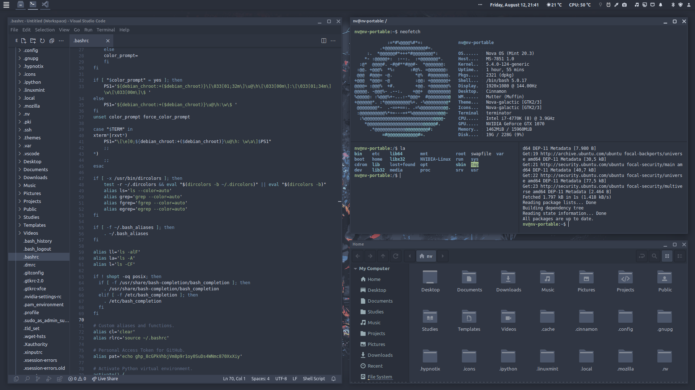
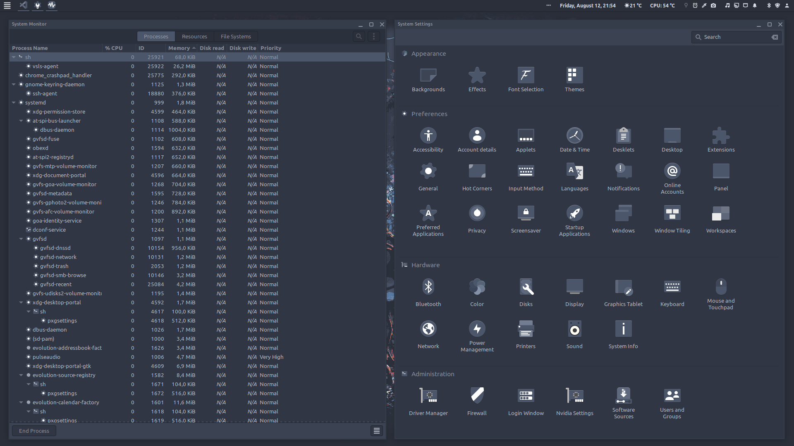
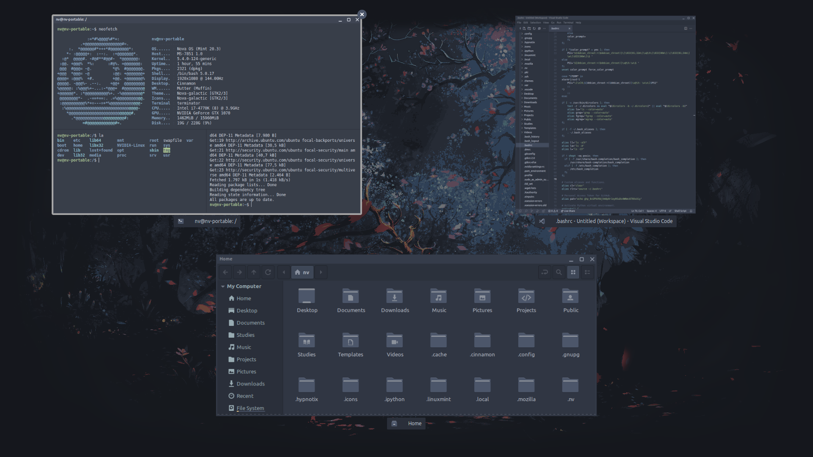
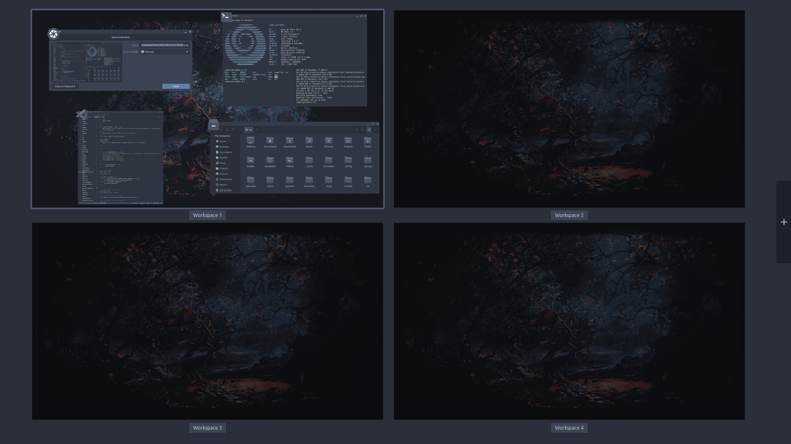

# Nova-galactic-theme
Inspired by the brilliant Nordic Darker theme, but adjusted for coherency and simplicity. The theme includes configs for cinnamon, gnome-shell, gtk-2.0, gtk-3.0, gtk-4.0, metacity-1 and xfwm4.

See the accompanying icon pack of the same name.

It was created for Nova-OS, a spin on the brilliant Linux Mint, on which I am currently working.

## Preview
Menu

Applets

Applications

System Applications

Expo

Workspaces

Screensaver

